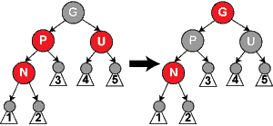
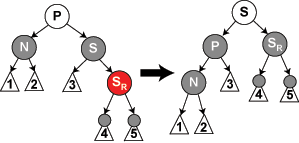

# tree

Table of Contents
=================

   * [tree](#tree)
      * [BinarySearchTree](#binarysearchtree)
         * [搜索](#搜索)
         * [插入](#插入)
         * [删除](#删除)
         * [sum up](#sum-up)
      <!-- * [AVL](#avl) -->
      * [红黑树](#红黑树)
         * [插入](#插入-1)
            * [case1](#case1)
            * [case2](#case2)
            * [case3](#case3)
            * [case4](#case4)
            * [case5](#case5)
         * [删除](#删除-1)
            * [case1 N是新的根](#case1-n是新的根)
            * [case2 S是红色](#case2-s是红色)
            * [case3 P、S、S的孩子均为黑色。](#case3-pss的孩子均为黑色)
            * [case4 P为红色，S、S的孩子为黑色](#case4-p为红色ss的孩子为黑色)
            * [case5 需要交换的情况](#case5-需要交换的情况)
            * [case6 S是黑色，S的右儿子是红色](#case6-s是黑色s的右儿子是红色)
         * [红黑树总结](#红黑树总结)

Created by [gh-md-toc](https://github.com/ekalinin/github-markdown-toc)

## BinarySearchTree

树的递归往往需要改前驱，参数为节点指针的引用会比较方便。

BST的性质就是，每棵子树，左侧小右侧大。

### 搜索

迭代搜索比较好，效率更高。实现不难。

### 插入

传指针引用，递归式实现就很方便了。

### 删除

之前理解有问题，一直在想用哪个结点替换被删除结点。没有实现过，就会自以为是。。

> what I cannot create, I do not understand.

实际上，被删除结点首先根据孩子数量分为三种情况。

1. 叶子结点。直接删除，清空它在父节点的指针。（也传入指针引用。实现方便）。
2. 单孩子结点。把它在父节点的位置给它唯一的孩子。
3. 双子结点。此时才需要考虑用哪个结点替换它。此时可以选择，使用前驱替换还是后继替换。这里实际是一个递归删除的过程，因为后继是需要被删除的，而这也属于这三种情况中的一种（实际上最多只有一个孩子）。

### sum up

这么基本的数据结构都要想这么久，可见基础之差。

## AVL

## 红黑树

红黑树相对于AVL树来说，牺牲了部分平衡性以换取插入/删除操作时少量的旋转操作，整体来说性能要优于AVL树。

即允许在更多输入时，树不进行调整；但少数调整时情况会复杂。情况复杂到，感觉像是有更好的算法似的。。

> 插入的时候，预设为红色节点。不冲突的可能性比AVL的高。

**维持的红黑树性质：**
1. 节点是红色或黑色。
2. 根是黑色。
3. 所有叶子都是黑色（叶子是NIL节点）。
4. 每个红色节点必须有两个黑色的子节点。（从每个叶子到根的所有路径上不能有两个连续的红色节点。）
5. 从任一节点到其每个叶子的所有简单路径都包含相同数目的黑色节点。（注意，将树的边视为单向的）

> 第四条 与 第五条 确保了从根到叶子的最长可能路径不多于最短可能路径的两倍。
> 
> 为方便，使用黑色空叶子填充所以空指针，参与计数。

维护平衡树性质，需要少量（O(logn)）的颜色变更和不超过三次的树旋转（插入操作为两次）。操作时间保持在O(logn)次。

### 插入

被插入的节点称为N，父节点为P，祖父节点为G，父亲的兄弟为U。

先按BST的方式插入节点，然后对上述节点做以下检查。

> 插入的节点默认为红色，以期望进行更少的调整（因为第五条是限制黑色的）
> 
> 由于插入节点是红色，不会影响性质5

#### case1 N为根节点

N为根节点，则改为红。

#### case2 P为黑色

P为黑，未失效，不做修改。

#### case3 P与U为红（则G为黑）



P且U为红，改两者为黑。G改为红。对G递归的进行插入检查。

> 将G变成红色，可能：它是根节点 或 它的父亲是红色，破坏了性质2或4。

#### case4 旋转情况

> 下面假设P是G的左子节点。若为右节点，操作相反。
> 
> 注意下图中，1、2、3、U所对应子树，根节点到叶节点的黑节点数目相同。


若P为红，U为黑，N是P的右子节点，则对N作左旋转，将P变为N的左子节点，然后进行case5的调整。

> 红色节点之间的旋转不影响第五条性质。

#### case5 

> 下面假设P是G的左子节点，若为右节点，操作相反。
> 
> 注意下图中，1、2、3、U所对应子树，根节点到叶节点的黑节点数目相同。


P是红色，U是黑色，则对G进行左旋转。一定会产生性质5的破坏，此时只需要将P和G的颜色交换就好了。

### 删除

删除的情况分三种，都可以转换为删除节点有一个儿子（不算null节点）的情况。若有两个儿子，则转换成删除前驱或后继点，两者一定是单孩子的；若没有儿子，将一个null节点视为儿子。下述只讨论这种情况。

要删除的节点 为红色，只需将它的孩子接续到其父节点上即可，不影响性质。如果 为黑色，但是其儿子是红色，也可以直接接上来，将儿子改为黑色即可。

最复杂的情况是，要删除的节点 和 它的儿子都是黑色的情况。我们先用儿子替换它，然后做下面的调整。设儿子为N，N的兄弟是S，现在的父亲是P，$S_L$ 与 $S_R$ 为S的左右孩子。

> 值得注意的是，触发的复杂情况时，被删除节点的两个孩子都是null叶子。因为除这种情况，它的一个儿子是null节点，另一个儿子子树（到叶子的长度）至少有两个黑节点（因为一定有null节点），冲突了。
> 
> 可以想象，此时N现在的父亲的两条支路，黑色节点数目相差 1。
> 
> 下面各个情况，要关注N，$S_L$，$S_R$的黑节点长度。实际上是想要和兄弟节点

#### case1 N是新的根

不需做调整。

#### case2 S是红色

对S做左旋转，将S、P换颜色。使N的父亲为红色，新的S为黑色。N与新S差1的路径长度。

> 就是换了个黑色兄弟，使父亲变为红色

#### case3 P、S、S的孩子均为黑色。

将S换为红色。此时P所在的子树无矛盾，但路径长度比删除前少1，需要重新对P做删除平衡处理（将P视为N）。（递归）

#### case4 P为红色，S、S的孩子为黑色


交换P和S的颜色即可。此时直接填补了通过N的黑色节点数目。

> S的孩子必须为黑，否则不能做交换呀

#### case5 需要交换的情况

> 假设N是P的左儿子


S的左儿子是红的，右儿子是黑的，对S做左旋转。交换S和$S_L$的颜色。（只是预处理工作）。进入case6。

#### case6 S是黑色，S的右儿子是红色

> 此时P的颜色任意，可能是红色，可能是黑色。
>
> 仍然假设了N是P的左儿子。



此时对S做一左旋转，是S的右儿子变黑。赋值是S与P变化前颜色一致。

### 红黑树总结

目前可以确定每个操作都是对的，但是还不能记诵。复制一处[stackoverflow](https://stackoverflow.com/questions/9469858/how-to-easily-remember-red-black-tree-insert-and-delete)的回答。

```
Rotating puts the tree in a state where it meets the criteria to recolor (the child node has a red uncle). There are two key differences:
1. which node is the "child" and which node is the "uncle" has changed;
2. instead of recoloring the parent and uncle to black and the grandparent to red, you recolor the parent to red, and the grandparent to black.
// 插入节点为child，红色；要改变父亲的颜色为黑，此时uncle若为红，可以将它也改为黑，保证颜色一致；否则需要借助旋转

Now let's look at how the rotation transforms the tree so that we have a child node with a red uncle and can use recoloring. I recommend drawing this out to fully understand it.

1. Let x be the current red node with a red parent.
2. Let p be the red parent of x before the rotation (if the parent was black, we'd be done already).
3. Let y be the black uncle of x before the rotation (if the uncle was red, we wouldn't need a rotation. We'd simply recolor the parent and uncle to black and the grandparent to red).
4. Let g be the black grandparent of x before the rotation (since the parent is red, the grandparent must be black; otherwise this was not a red-black tree to begin with.)
// 需要旋转的情况就是LL/RR 与 LR/RL两种，N/P是red，G/U是black
5. When you have a left-left (LL) or right-right (RR) case (that is, x is the left child of p and p is the left child of g OR x is the right child of p and p is the right child of g), after a single rotation (right if LL, left if RR), y becomes the child and x its uncle. Since x is a red uncle, you now have a case where you can recolor. So, recolor the parent of the child (since the child is now y, its parent is g) to red, and the child's grandparent (which is now p) to black.
// LL/RR需要单旋转，使得N称为了 red uncle
6. When you have an LR (x is the left child or p and p is the right child of g) or RL case (x is the right child of p and p is the left child of g), after a double rotation (right then left if LR, left then right if RL), y becomes the child and p its uncle. Since p is a red uncle, you again have a case where you can recolor. So, recolor the parent (since the child is now y, its parent is g) to red, and the child's grandparent (which is now x) to black.
//否则需要双旋转
```


